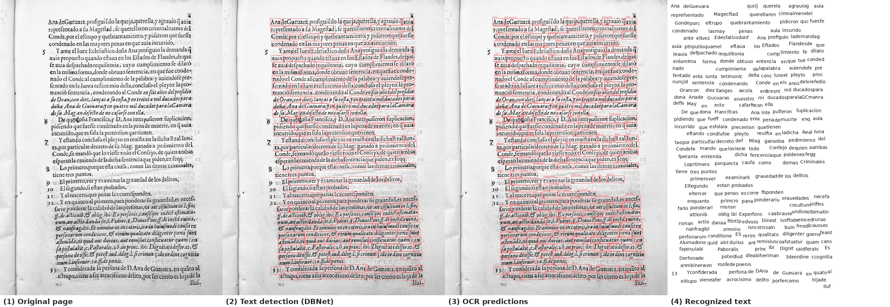
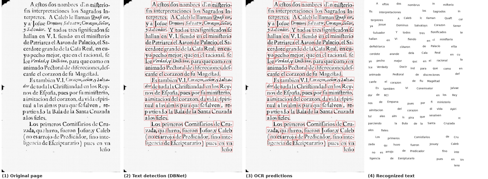
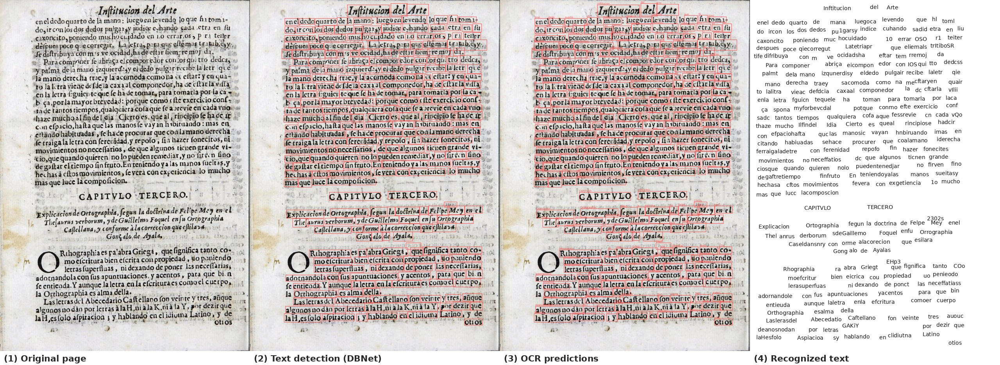

# EarlySpanishOCR

A two-stage OCR pipeline for digitizing early printed Spanish documents (17th–18th century). The system combines word-level text detection with a Transformer-based text recognition model.

## Pipeline Overview

```
PDF Scans → Image Preprocessing → Text Detection (DBNet) → Text Recognition (Transformer) → Transcription
```

**Stage 1 — Text Detection**
Uses [DBNet](https://github.com/MhLiao/DBNet) to detect word-level bounding boxes. Detection output is converted from polygon format into TextOCR-compatible JSON.

**Stage 2 — Text Recognition**
A Transformer-based sequence recognition model trained on the [TextOCR](https://textvqa.org/textocr/) dataset. Input word crops are resized to `32 × 256` and decoded with a greedy CTC decoder. The character set includes standard Latin characters plus early Spanish ligatures (`ÑñÇçſ`).

## Pipeline Visualizations

Each row shows a sample page at three stages: the original scan, word-level bounding boxes detected by DBNet, and the final OCR predictions overlaid on each box.

**Porcones (legal document)**


**Ezcaray — Vozes del dolor**


**Paredes — Reglas generales**


## Results

Evaluated using Character Error Rate (CER) on 19 transcribed pages of early Spanish documents:

| Model | Training Data | CER (Early Spanish) | CER (TextOCR test set) |
|---|---|---|---|
| Transformer | TextOCR only | 0.60 | 0.10 |

The high CER on Early Spanish documents is expected given the domain gap. Fine-tuning on in-domain pages is expected to substantially reduce error.

## Installation

1. Install PyTorch following the [official guide](https://pytorch.org/get-started/locally/) (tested with PyTorch 2.1.0).

2. Install remaining dependencies:
   ```bash
   pip install -r requirements.txt
   ```

3. Download pretrained weights and place them under `checkpoints/`:
   ```
   https://drive.google.com/drive/folders/19K3sCv3esTawo7QiO-0BHwUYbT-kGXwy?usp=sharing
   ```

## Usage

### Full Inference Pipeline

Run text recognition on DBNet-detected word crops and evaluate CER against ground-truth transcriptions:

```bash
python src/inference_model_box2text.py \
  --json_input json/TextOCR_DB/merged_textocr.json \
  --json_output json/TextOCR/spanish_final.json \
  --config config/transformer_word_TextOCR_full.yaml \
  --image_root dataset/final_images \
  --gt_dir dataset/transcript_processed \
  --print_output
```

> All required inputs for this script are committed to the repository.

### Single Image Inference

```bash
python src/inference_model_box2text.py \
  --image_path path/to/cropped_word.jpg \
  --config config/transformer_word_TextOCR_full.yaml
```

## Data Preparation

### 1. Preprocess PDF Scans

Converts PDFs to images (300 DPI), applies adaptive binarization, and denoises via morphological operations:

```bash
python src/preprocess.py \
  --pdf_folder dataset/scans \
  --output_folder dataset/final_images
```

### 2. Process Ground-Truth Transcriptions

Normalizes raw transcription `.txt` files into a clean format for CER evaluation:

```bash
python src/dataset/Spanish_GT_process.py \
  --input_dir dataset/transcription \
  --output_dir dataset/transcript_processed
```

### 3. Convert DBNet Output to TextOCR Format

Converts DBNet polygon detections (one `.txt` per image) into a merged TextOCR-compatible JSON:

```bash
python src/other_models/db_to_textocr.py \
  --txt_dir DB \
  --image_dir DB \
  --output_dir json/TextOCR_DB \
  --merge_into_one
```

## Repository Structure

```
├── config/                  # YAML training and inference configs
├── dataset/
│   ├── final_images/        # Preprocessed page images
│   └── transcript_processed/# Normalized ground-truth transcriptions
├── src/
│   ├── dataset/             # Dataset preparation scripts
│   ├── other_models/        # DBNet output conversion utilities
│   ├── helpers/             # Miscellaneous utilities
│   ├── inference_model_box2text.py  # Main inference script
│   ├── preprocess.py        # PDF-to-image conversion and preprocessing
│   └── utils.py             # Greedy/beam-search decoders, char mapping
└── checkpoints/             # Pretrained model weights (downloaded separately)
```

## Document Sources

The dataset includes scanned pages from the following early Spanish printed works:

- *Instrucción* — Buendía
- *Constituciones sinodales* — Calahorra, 1602
- *Vozes del dolor* — Ezcaray
- *Príncipe perfecto* — Mendo
- *Reglas generales* — Paredes
- *Porcones* (legal documents)
